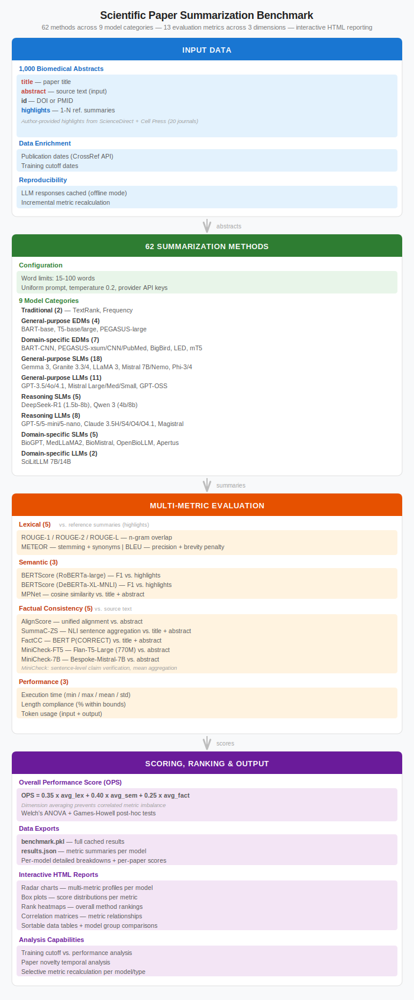

# Scientific Paper Summarization Benchmark

Benchmarking tool for evaluating text summarization methods on scientific papers.

## Quick Start

This project uses [uv](https://github.com/astral-sh/uv) for package management.

1. Clone this repository
2. Install dependencies
    ```bash
    cd llm_summarization_benchmark  
    uv sync
    uv run spacy download en_core_web_sm
    ```
3. Install AlignScore-large
    ```bash
    mkdir -p Output/llm_summarization_benchmark
    cd Output/llm_summarization_benchmark
    wget https://huggingface.co/yzha/AlignScore/resolve/main/AlignScore-large.ckpt
    cd ../..
    ```
4. Copy `Resources/example.env` to `Resources/.env` and adjust
5. Run
    ```bash
    uv run benchmark
    ```

> **Hint:** Individual LLM config parameters are stored in `/src/llm_apis/config.py`

### Run the visualization without benchmarking

The following files must be in place in order to load previous results:    
- `Output/llm_summarization_benchmark/benchmark.pkl`
- `Output/llm_apis/cache.json`

Afterwards, simply run the benchmark again - processed results will be skipped.

---

## Workflow


---

## text_summarization_goldstandard_data.json
Document store in `Resources` folder, containing ID, title, abstract and reference summaries.
1-N reference summaries can be provided per paper. 
Multiple reference summaries improve evaluation robustness and reduce single-annotator bias.

```json
[
  {
    "title": "Paper Title",
    "abstract": "Paper abstract text...",
    "id": "paper_001",
    "summaries": [
      "This paper analyzes ..",
      "The paper investigates .. "
    ]
  }
]
```
### Reference summary sources
- Highlight sections of Elsevier and Cell papers, manually extracted and joined by ". ".

---

## Summarization Methods 

### **local:textrank**
1. Tokenizes sentences ([nltk](https://www.nltk.org/api/nltk.tokenize.html#nltk.tokenize.sent_tokenize))
2. Creates TF-IDF vectors for sentence representation ([sklearn](https://scikit-learn.org/stable/modules/generated/sklearn.feature_extraction.text.TfidfVectorizer.html#sklearn.feature_extraction.text.TfidfVectorizer))
3. Calculates cosine similarities between TF-IDF vectors (sklearn)
4. Builds similarity graph with cosine similarities as edge weights (networkx)
5. Applies PageRank to rank sentences by importance ([networkx](https://networkx.org/documentation/stable/reference/algorithms/generated/networkx.algorithms.link_analysis.pagerank_alg.pagerank.html))
6. Selects highest-scoring sentences within word count limits while preserving original order
> **WARNING**: Results might be misleading when gold-standard summaries are (partial) copies from the source document, rather than being abstractive

### **local:frequency**
1. Calculates word frequency scores
2. ranks sentences by avg. word frequency (excluding stopwords ([nltk](https://www.nltk.org/))
3. selects highest-scoring sentences (in original order) within word count limits

### LLM Providers
- **Anthropic**, **Mistral**, **OpenAI**, **HuggingFace**, **Ollama**`

---

## Evaluation Metrics
> Each generated summary is evaluated against all available gold-standard reference summaries of a document using a number of metrics as listed below. For each metric, mean/min/max/std and individual counts are computed.

### Rouge
Set of metrics for evaluating summary quality by comparing to reference summaries. [wiki](https://en.wikipedia.org/wiki/ROUGE_(metric)) | [package](https://github.com/google-research/google-research/tree/master/rouge) | [publication](https://aclanthology.org/W04-1013.pdf)
- **ROUGE-N**: N-gram co-occurrence statistics between system and reference summaries.
  - **ROUGE-1**: Overlap of unigrams (individual words)
  - **ROUGE-2**: Overlap of bigrams (word pairs)
- **ROUGE-L**: Longest Common Subsequence (LCS) based statistics that capture sentence-level structure similarity by awarding credit only to in-sequence word matches.

### Bert
Semantic similarity using BERT embeddings. [paper](https://arxiv.org/abs/1904.09675) | [package](https://github.com/Tiiiger/bert_score)
- `roberta-large`: Default model [paper](https://arxiv.org/abs/1907.11692) | [model](https://huggingface.co/FacebookAI/roberta-large)
- `microsoft/deberta-xlarge-mnli`: Proposed as "better model" [paper](https://arxiv.org/abs/2006.03654) | [model](https://huggingface.co/microsoft/deberta-xlarge-mnli))

### Meteor
Matches words through exact matches, stemming, synonyms, and considers word order. Claims to outperform BLEU. [paper](https://www.cs.cmu.edu/~alavie/METEOR/pdf/Lavie-Agarwal-2007-METEOR.pdf) | [function]()

### BLEU
N-gram overlaps with brevity penalty. [paper](https://www.aclweb.org/anthology/P02-1040.pdf) | [function](https://www.nltk.org/api/nltk.translate.bleu_score.html#nltk.translate.bleu_score.sentence_bleu)

### all-mpnet-base-v2
Semantic similarity using sentence transformers. Compares generated summary directly against the source document 
(rather than reference summaries like other metrics). [model](https://huggingface.co/sentence-transformers/all-mpnet-base-v2)

### AlignScore
Factual consistency evaluation using the abstract. [paper](https://arxiv.org/abs/2305.16739) | [modified repository](https://github.com/MNikley/AlignScore)

### Further Metrics
- **Execution Time**: Processing time
- **Length Compliance Metrics**
  - **Within Bounds**: Percentage meeting length constraints
  - **Too Short/Long**: Violation statistics with percentages
  - **Average Length**: Mean word count with standard deviation
  - **Length Distribution**: Detailed statistical analysis

---

## Reference


**Systematic evaluation and benchmarking of text summarization methods for biomedical literature: From word-frequency methods to language models**
Baumgärtel F, Bono E, Fillinger L, Galou L, Kęska-Izworska K, Walter S, Andorfer P, Kratochwill K, Perco P, Ley M
bioRxiv 2026, [doi.org/10.64898/2026.01.09.697335](https://doi.org/10.64898/2026.01.09.697335)


